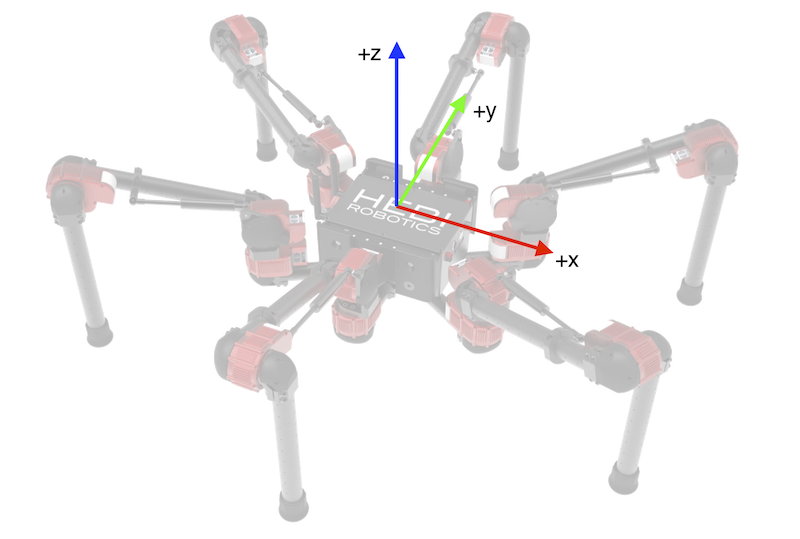
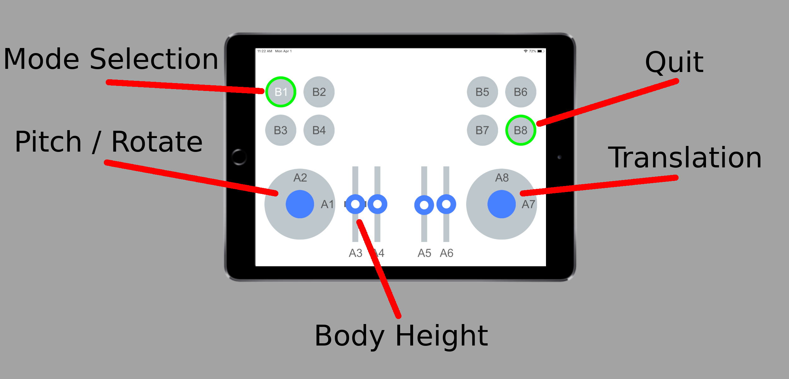

# Daisy Python Demo

## Requirements

### Controller

The demo requires a Mobile IO device acessible from the computer running the demo.

### Software Requirements 
* [HEBI Python API](https://pypi.org/project/hebi-py/)
* [PySDL2](https://pypi.org/project/PySDL2/)
  * **Linux Users:** You should check if your distro has a package for this already. For Ubuntu, install the [pysdl2 package](https://launchpad.net/ubuntu/+source/pysdl2)
  * If not installing through a package manager, make sure you have the SDL2 library installed!

## Assembling / Setting Up Daisy

If you are assembling Daisy, you can follow the assembly instructions found at:
http://docs.hebi.us/resources/kits/assyInstructions/X-Series_Hexapod.pdf

Gains, control parameters, and kinematic information are all set automatically in the demo code. If you want to view or change these parameters you can refer to the files below.  
- Actuator gains can be found in [daisyLeg-Gains.xml](resources/gains18.xml).
- The HRDF files that define the kinematics of the robot can be found in the [resources/](resources/) folder.

## Running

Simply run the `daisy.py` file. You can run this in a terminal by executing
```sh
python3 daisy.py
```

**Only Python 3 is supported.** Python 2 has been discontinued. Please upgrade to run this demo!

**Note:** By default, the demo will look for a Mobile IO device with family `HEBI` and name `Mobile IO`. You can change the family and name with `--mobile-io-family` and `--mobile-io-name`.

## Coordinate frame convention



* `X` = forward (from driver's perspective)
* `Y` = left (from driver's perspective)
* `Theta` = counter-clockwise rotation

## Controls

The demo provides default mappings for the Mobile IO app. You can modify them, if needed, by editing the `components/configuration.py` file directly.

### Mobile IO

| Input      | Command   | Note  |
| ----------------- | ----------------- | ----------- |
| Right Joystick (`A8` and `A7`)  | Base X-Y Velocity (forward/back, left/right) |  |
| Left Joystick (`A1`) | Base Theta Velocity (turning) |  |
| Slider (`A3`) | Chassis Z Velocity (body height up and down) |  | 
| Button (`B1`) | Toggle Stance Mode / Step Mode | When in stance mode the robot chassis will shift around due to the joystick velocity commands, but the feet will not move. The button is blue when in stance mode. |
| Button (`B8`) | Exit the demo. | The border of the the HEBI Mobile I/O app will no longer be highlighted green after exiting. |



Note that even though the image above notes 'Pitch', this demo does not currently control pitch.
