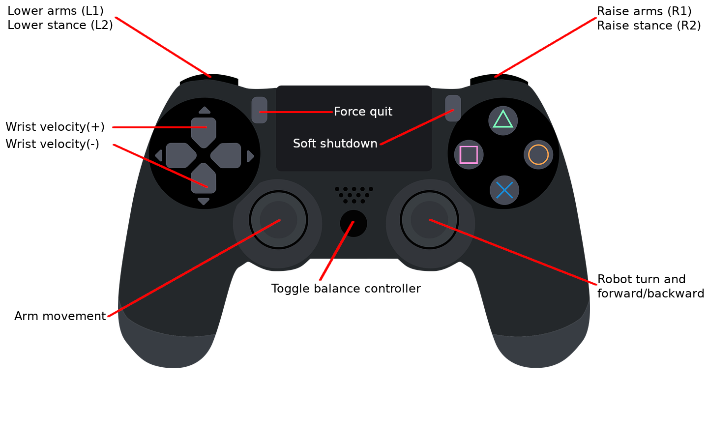

# Igor Balancing Robot Matlab Demo

## Requirements

### Controller

The demo can be run using either a gamecontroller or Mobile IO device acessible from the computer running the demo.

* USB controller (Must be compatibile with SDL2 - check [here](https://github.com/gabomdq/SDL_GameControllerDB/blob/master/gamecontrollerdb.txt) for your controller)
* Mobile IO (Requires HEBI's Mobile IO app on an Android or iOS device)

### Software Requirements 
* [HEBI Python API](https://pypi.org/project/hebi-py/)
* [PySDL2](https://pypi.org/project/PySDL2/)
  * **Linux Users:** You should check if your distro has a package for this already. For Ubuntu, install the [pysdl2 package](https://launchpad.net/ubuntu/+source/pysdl2)
  * If not installing through a package manager, make sure you have the SDL2 library installed!

## Running

Simply run the `igor2_demo.py` file located at `kits/igor2`. Both Python 2 and 3 are supported, but note that Python 2 upstream will become [unsupported 1 Jan 2020.](https://pythonclock.org/)

Note: By default, the demo will look for a USB gamecontroller. You must provide arguments to specify a Mobile IO device if you want to control Igor using a mobile device.

## Controls

The default gamecontroller mappings are as followed. Note that the image is of a generic Sony Playstation 4 controller, but the concept applies to all other SDL2 compatible controllers.

