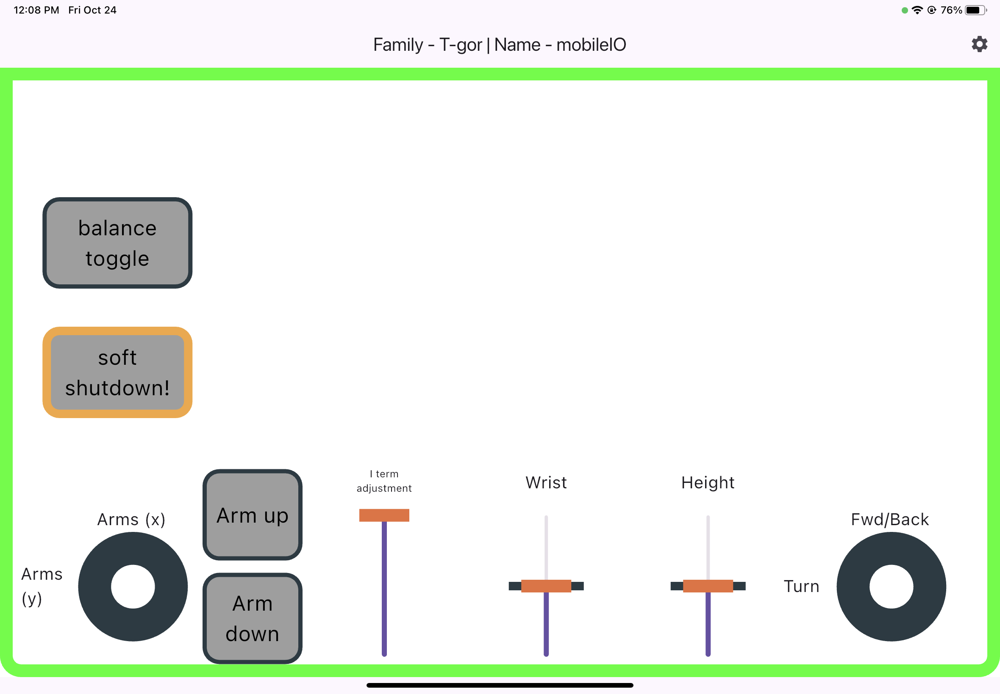

# Igor Balancing Robot Python Demo

## Requirements

### Controller

The demo can be run using a Mobile IO device acessible from the computer running the demo. This can be either:

* HEBI's Mobile IO app on an Android or iOS device
* A joystick or keyboard connected through [HEBI Input](http://docs.hebi.us/tools.html#hebi-input)

### Software Requirements 
* [HEBI Python API](https://pypi.org/project/hebi-py/)

## Running

Simply run the `igor2_demo.py` file located at `kits/igor2`. You can run this in a terminal by executing
```sh
python3 igor2_demo.py
```

**Note:** By default, the demo will look for a Mobile IO device with family `T-gor` and name `mobileIO`. This is configurable by changing the relevant fields in the `resources/config.yml` file, or creating your own config file and changing the file referenced in `igor2_demo.py`.

## Controls

The demo provides default mappings for the MobileIO controller. You can modify them, if needed, by editing the `components/configuration.py` file directly and also updating the `layout/run.json` and `layout/idle.json` MobileIO layout configuration files.

The exact layout of the application may appear slightly different on your device than what is shown, but the behavior should match:

